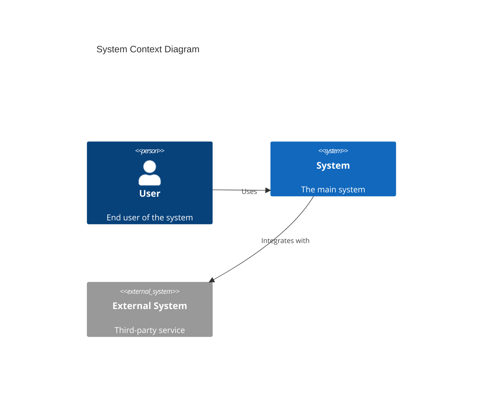

# C4 Model Architecture Documentation Context

> This document provides comprehensive context about the C4 model for software architecture visualization. Use this as a reference when understanding, analyzing, or creating C4 diagrams.

## Overview

The C4 model is a lean graphical notation technique for modelling the architecture of software systems. Created by Simon Brown, it uses a hierarchy of four abstraction levels (Context, Containers, Components, Code) to describe software architecture in a way that is accessible to both technical and non-technical audiences.

**Core Philosophy**: "Abstraction-first" approach - define abstractions before creating diagrams. Not all four levels are required; use only those that add value.

---

## The Four Core Abstractions

### Level 0: Person
- **Definition**: Users, actors, roles, or personas that interact with software systems
- **Representation**: Human figures or simple shapes representing user types
- **Examples**: Customer, Administrator, Support Staff, API Consumer

### Level 1: Software System
- **Definition**: The highest level of abstraction; a system that delivers value to users
- **Characteristics**:
  - Something that users interact with
  - May be owned by you or external parties
  - Black box at this level - internal details hidden
- **Examples**: E-commerce Platform, Banking System, CRM, Third-party Payment Gateway

### Level 2: Container
- **Definition**: An application or data store that executes code or stores data
- **Key Point**: NOT Docker containers - "container" means a deployable/runnable unit
- **Types**:
  - Server-side web applications (Java EE, .NET, Node.js)
  - Client-side applications (SPA, mobile apps, desktop apps)
  - Microservices
  - Serverless functions
  - Database schemas
  - File systems
  - Blob/object storage (S3, Azure Blob)
  - Message queues and topics
- **Characteristics**: Separately deployable/runnable, typically run in their own process space

### Level 3: Component
- **Definition**: A grouping of related functionality encapsulated behind a well-defined interface
- **Characteristics**:
  - Logical grouping within a container
  - Not separately deployable
  - Examples: Controllers, Services, Repositories, Modules
- **Note**: Often maps to implementation concepts like packages, namespaces, or modules

### Level 4: Code
- **Definition**: Actual code elements - classes, interfaces, functions, objects
- **Usage**: Rarely created manually; typically auto-generated from code
- **Recommendation**: Only create if truly necessary; becomes outdated quickly

---

## Diagram Types

### 1. System Context Diagram (Level 1)

**Purpose**: Show the big picture - how the system fits into the world

| Aspect | Details |
|--------|---------|
| **Scope** | A single software system |
| **Audience** | Everyone - technical and non-technical |
| **Primary Element** | The software system in scope (centered) |
| **Supporting Elements** | People (users), External software systems |
| **Focus** | Relationships and dependencies, NOT technical details |
| **Recommended** | Yes - for ALL software development teams |

**Key Characteristics**:
- Highest level of abstraction
- Shows who uses the system and what external systems it depends on
- External systems are typically outside your control/ownership
- Detail is NOT important - this is the zoomed-out view
- Focus on people and systems, not protocols or technologies

### 2. Container Diagram (Level 2)

**Purpose**: Zoom into the system boundary to show high-level architecture

| Aspect | Details |
|--------|---------|
| **Scope** | A single software system |
| **Audience** | Technical people - architects, developers, operations |
| **Primary Elements** | Containers within the system |
| **Supporting Elements** | People, External software systems |
| **Focus** | Major technology choices, responsibility distribution, communication patterns |
| **Recommended** | Yes - for ALL software development teams |

**Key Characteristics**:
- Shows the shape of the software system
- High-level technology focused
- Each container is a separately deployable unit
- Shows inter-container communication
- Does NOT include deployment details (clustering, load balancers) - those go in deployment diagrams

### 3. Component Diagram (Level 3)

**Purpose**: Decompose a container to show internal components

| Aspect | Details |
|--------|---------|
| **Scope** | A single container |
| **Audience** | Software architects and developers |
| **Primary Elements** | Components within the container |
| **Supporting Elements** | Other containers, People, External systems connected to components |
| **Focus** | Component responsibilities, technology/implementation details |
| **Recommended** | Only if it adds value |

**Key Characteristics**:
- Shows logical components within a container
- Useful for understanding internal structure
- Consider automating generation for long-lived documentation
- May change frequently during development

### 4. Code Diagram (Level 4)

**Purpose**: Show code-level structure (classes, interfaces, etc.)

| Aspect | Details |
|--------|---------|
| **Scope** | A single component |
| **Audience** | Developers |
| **Elements** | Classes, interfaces, functions, objects |
| **Focus** | Implementation details |
| **Recommended** | Rarely - becomes outdated very quickly |

**Key Characteristics**:
- Lowest level of abstraction
- Typically uses UML class diagrams
- Should be auto-generated if needed
- Most teams skip this level entirely

---

## Supplementary Diagrams

### System Landscape Diagram

**Purpose**: Enterprise-wide view of how multiple software systems interconnect

| Aspect | Details |
|--------|---------|
| **Scope** | Enterprise, organization, or department |
| **Difference from System Context** | No specific focus on one system - shows entire landscape |
| **Audience** | Technical and non-technical stakeholders |
| **Use Case** | Especially valuable for larger organizations |

**Key Point**: "Software systems never live in isolation" - this diagram documents the portfolio of systems and their relationships.

### Dynamic Diagram

**Purpose**: Show runtime behavior and interactions for specific scenarios

| Aspect | Details |
|--------|---------|
| **Scope** | A specific feature, story, use case, or capability |
| **Based On** | UML communication/collaboration diagrams |
| **Elements** | Software systems, containers, or components (your choice of abstraction) |
| **Usage** | Use SPARINGLY - only for interesting/complex interaction patterns |

**Styles**:
1. **Collaboration Style**: Free-form layout with numbered interactions
2. **Sequence Style**: Linear timeline presentation

**Key Point**: Both styles convey identical information - choose based on preference.

### Deployment Diagram

**Purpose**: Map containers to infrastructure for a specific deployment environment

| Aspect | Details |
|--------|---------|
| **Scope** | One or more software systems within a deployment environment |
| **Audience** | Technical - architects, developers, infrastructure, operations |
| **Primary Elements** | Deployment nodes, container instances, infrastructure nodes |
| **Recommended** | Yes - for comprehensive documentation |

**Deployment Nodes**:
- Physical servers
- Virtual machines
- Container platforms (Docker, Kubernetes)
- Execution environments
- PaaS offerings

**Infrastructure Nodes**:
- DNS services
- Load balancers
- Firewalls
- CDNs

**Best Practice**: Use cloud provider icons (AWS, Azure, GCP) but include them in the legend.

---

## Notation Guidelines

### Diagram Structure Requirements

1. **Title**: Every diagram MUST have a descriptive title
   - Format: `[Diagram Type] for [Scope]`
   - Example: "System Context diagram for Internet Banking System"

2. **Key/Legend**: Every diagram MUST include a legend explaining:
   - Shapes and their meanings
   - Colors and their significance
   - Line styles (solid, dashed)
   - Arrow types

### Element Notation

Each element should include:
- **Name**: Clear, descriptive name
- **Type**: Explicitly state (Person, Software System, Container, Component)
- **Description**: Brief text conveying key responsibilities
- **Technology** (for Containers/Components): Specify the tech stack

### Relationship Notation

- **Direction**: Lines are unidirectional - show direction of dependency or data flow
- **Labels**: Every line needs a descriptive label
  - Be specific: "sends customer update events to" > "uses"
  - Match description to arrow direction
- **Technology**: Specify protocols for container relationships (HTTP, gRPC, AMQP, etc.)

### Color Guidelines

The C4 model does NOT mandate specific colors. Guidelines:
- Maintain consistency within and across diagrams
- Ensure accessibility for color-blind viewers
- Test compatibility with black/white printing
- Common convention (not required):
  - Blue for internal elements
  - Grey for external systems
  - Different shades for different element types

### Flexibility

C4 diagrams can be rendered using:
- Simple boxes and lines
- UML notation
- ArchiMate elements
- Interactive visualizations (D3.js, Ilograph)

---

## Review Checklist

### General Checks
- [ ] Does the diagram have a title?
- [ ] Is the diagram type clear?
- [ ] Is the scope obvious?
- [ ] Is there a key/legend?

### Element Checks
- [ ] Does every element have a name?
- [ ] Is the abstraction level clear (Person, System, Container, Component)?
- [ ] Is the purpose/functionality understandable?
- [ ] Are technology choices documented (where applicable)?
- [ ] Are all visual encodings (colors, shapes, icons) explained in the legend?

### Relationship Checks
- [ ] Does every line have a label describing intent?
- [ ] Does the description match the arrow direction?
- [ ] Are communication technologies specified?
- [ ] Are line styles explained in the legend?

---

## Best Practices

### General
1. Start with System Context, then Container - most teams don't need more
2. Keep diagrams simple and focused
3. Update Context/Container diagrams as architecture evolves
4. Component diagrams change more frequently - consider automation
5. Avoid Code diagrams unless auto-generated

### Avoiding Common Mistakes
1. Don't mix abstraction levels on the same diagram
2. Don't show too much detail at higher levels
3. Don't forget to include external systems and users
4. Don't use cryptic acronyms without explanation
5. Don't skip the legend

### Diagram Maintenance
- **System Context**: Changes slowly - update when external dependencies change
- **Container**: Changes slowly unless heavy microservices architecture
- **Component**: May change frequently during active development
- **Code**: Becomes outdated rapidly - auto-generate or skip

---

## Tooling Options

### Approaches
1. **Drag-and-drop diagramming**: Draw.io, Lucidchart, Miro
2. **Diagrams as code**: Structurizr DSL, PlantUML, Mermaid

### Structurizr DSL (Recommended for Code-Based)
```
workspace {
    model {
        user = person "User"
        softwareSystem = softwareSystem "Software System" {
            webapp = container "Web Application" "Delivers content" "Java/Spring"
            database = container "Database" "Stores data" "PostgreSQL"
        }
        user -> webapp "Uses"
        webapp -> database "Reads from and writes to"
    }
    views {
        systemContext softwareSystem {
            include *
            autolayout lr
        }
        container softwareSystem {
            include *
            autolayout lr
        }
    }
}
```

### PlantUML C4 Extension
```plantuml
@startuml
!include https://raw.githubusercontent.com/plantuml-stdlib/C4-PlantUML/master/C4_Container.puml

Person(user, "User", "A user of the system")
System_Boundary(system, "System") {
    Container(webapp, "Web App", "React", "Frontend application")
    ContainerDb(db, "Database", "PostgreSQL", "Stores data")
}
Rel(user, webapp, "Uses", "HTTPS")
Rel(webapp, db, "Reads/Writes", "SQL")
@enduml
```

### Mermaid (GitHub/Markdown Compatible)


---

## Quick Reference

| Level | Abstraction | Diagram | Audience | Recommended |
|-------|-------------|---------|----------|-------------|
| 1 | Software System | System Context | Everyone | Yes - Always |
| 2 | Container | Container | Technical | Yes - Always |
| 3 | Component | Component | Developers | Only if valuable |
| 4 | Code | Code | Developers | Rarely |
| - | Multiple Systems | System Landscape | Everyone | For large orgs |
| - | Runtime | Dynamic | Technical | Sparingly |
| - | Infrastructure | Deployment | Operations | Yes |

---

## References

- Official C4 Model Website: https://c4model.com
- Structurizr: https://structurizr.com
- C4-PlantUML: https://github.com/plantuml-stdlib/C4-PlantUML
