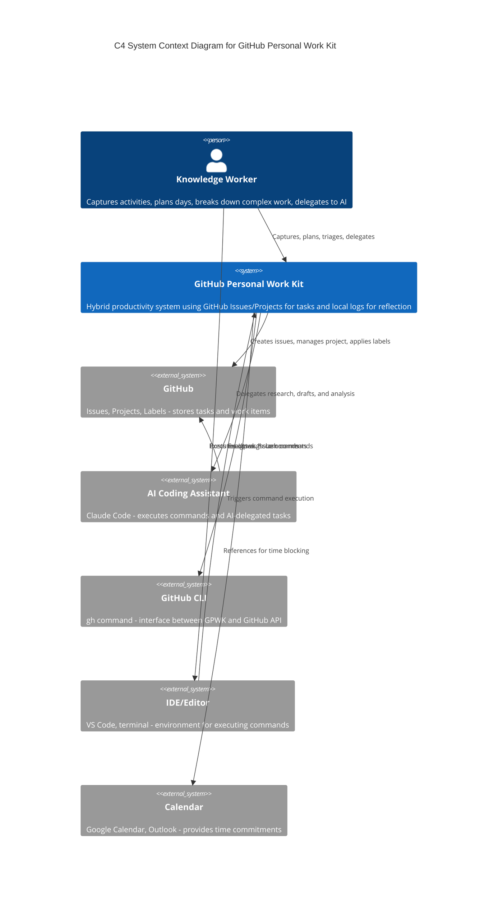
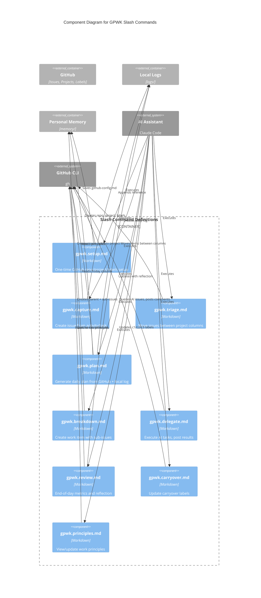
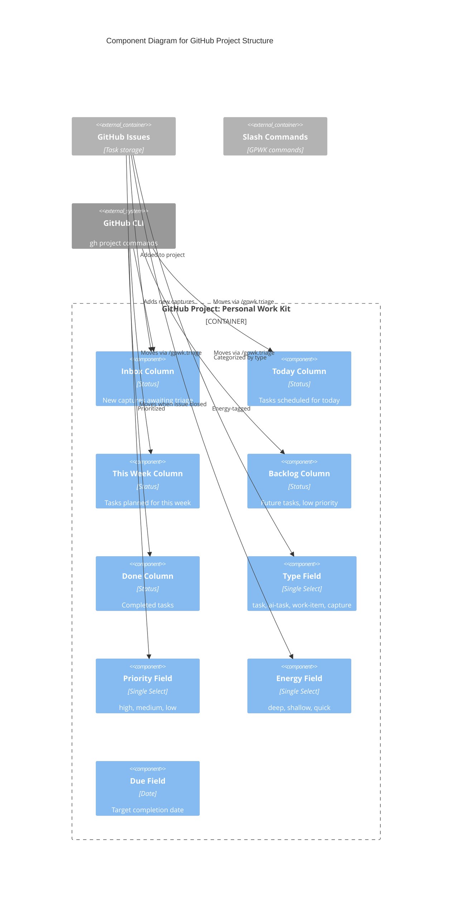
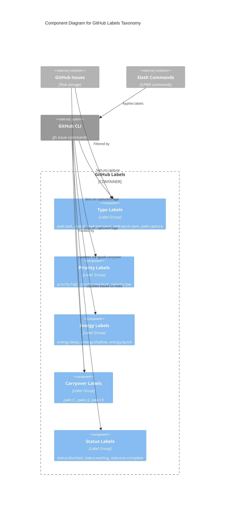
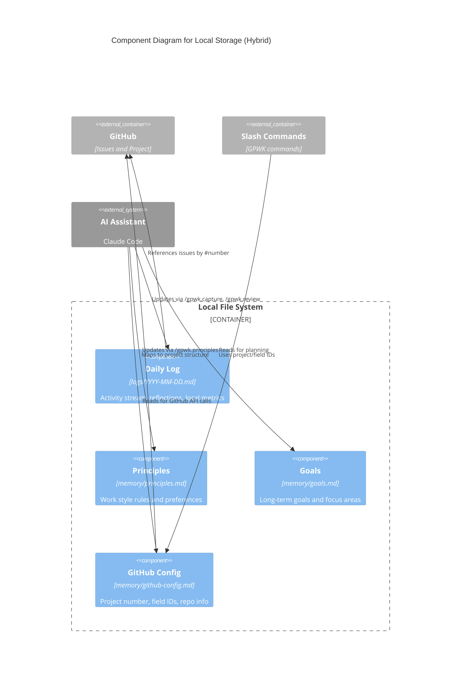
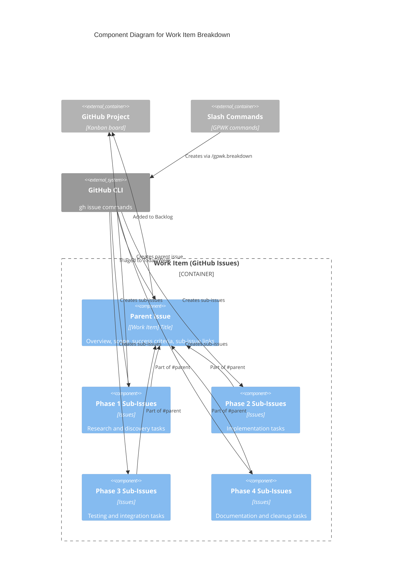
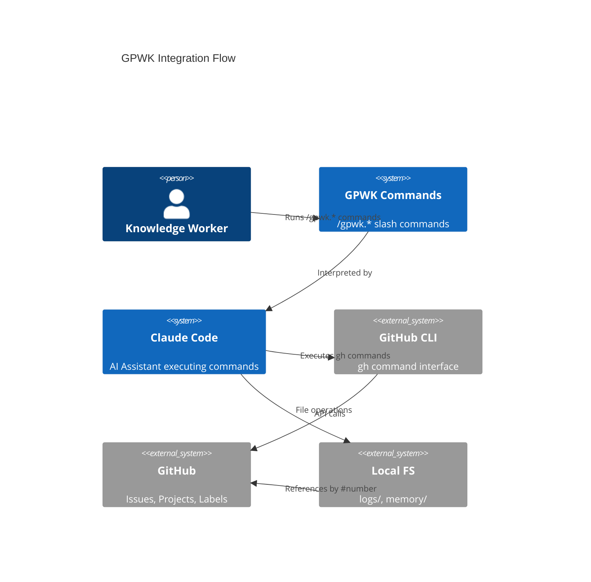

# GitHub Personal Work Kit (GPWK) C4 Architecture Diagrams

> C4 diagrams showing the architecture of GitHub Personal Work Kit at Context, Container, and Component levels.

## Table of Contents

1. [System Context Diagram](#1-system-context-diagram)
2. [Container Diagram](#2-container-diagram)
3. [Component Diagrams](#3-component-diagrams)

---

## 1. System Context Diagram

Shows GPWK and its interactions with users and external systems.



### Context Elements

| Element | Type | Description |
|---------|------|-------------|
| Knowledge Worker | Person | Primary user managing their daily work and tasks |
| GitHub Personal Work Kit | System | Hybrid toolkit integrating GitHub for tasks with local reflection |
| GitHub | External | Issues for tasks, Projects for workflow, Labels for metadata |
| GitHub CLI | External | `gh` command for programmatic GitHub access |
| AI Coding Assistant | External | Executes delegated [AI] tasks, posts results |
| IDE/Editor | External | Environment where slash commands are executed |
| Calendar | External | Source of time commitments for planning |

---

## 2. Container Diagram

Shows the internal containers within GitHub Personal Work Kit.

```mermaid
C4Container
    title C4 Container Diagram for GitHub Personal Work Kit

    Person(user, "Knowledge Worker", "Manages daily activities and tasks")

    System_Boundary(gpwk, "GitHub Personal Work Kit") {
        Container(slashCmds, "Slash Command Definitions", "Markdown", "Prompt definitions for /gpwk.* commands in .claude/commands/")
        Container(templates, "Templates", "Markdown", "Templates for issue bodies and local logs")
        ContainerDb(localLogs, "Local Activity Logs", "File System", "Daily reflection logs in logs/YYYY-MM-DD.md")
        ContainerDb(memory, "Personal Memory", "File System", "Principles, goals, and GitHub config in memory/")
    }

    System_Ext(github, "GitHub") {
        ContainerDb(issues, "GitHub Issues", "GitHub API", "Tasks, work items, AI results as issues")
        ContainerDb(project, "GitHub Project", "GitHub API", "Kanban board: Inbox, Today, This Week, Backlog, Done")
        ContainerDb(labels, "GitHub Labels", "GitHub API", "pwk:*, priority:*, energy:*, status:* labels")
    }

    System_Ext(aiAssistant, "AI Coding Assistant", "Claude Code - processes commands")
    System_Ext(ghCli, "GitHub CLI", "gh command")
    System_Ext(ide, "IDE/Editor", "VS Code, terminal")

    Rel(user, ide, "Executes /gpwk.* commands")
    Rel(ide, slashCmds, "Reads command definitions")
    Rel(slashCmds, aiAssistant, "Provides structured prompts")

    Rel(aiAssistant, ghCli, "Executes gh issue/project commands")
    Rel(ghCli, issues, "Creates, updates, closes issues")
    Rel(ghCli, project, "Manages project items and status")
    Rel(ghCli, labels, "Applies and removes labels")

    Rel(aiAssistant, localLogs, "Writes daily reflections")
    Rel(aiAssistant, memory, "Reads principles and config")

    Rel(slashCmds, templates, "Uses for issue bodies")
    Rel(memory, ghCli, "Provides project/field IDs")

    UpdateLayoutConfig($c4ShapeInRow="3", $c4BoundaryInRow="1")
```

### Container Descriptions

| Container | Technology | Description |
|-----------|------------|-------------|
| Slash Command Definitions | Markdown | 9 command files: setup, capture, plan, triage, breakdown, delegate, review, carryover, principles |
| Templates | Markdown | Templates for issue bodies, daily logs |
| Local Activity Logs | File System | `logs/YYYY-MM-DD.md` for daily reflection and activity stream |
| Personal Memory | File System | `memory/principles.md`, `memory/goals.md`, `memory/github-config.md` |
| GitHub Issues | GitHub API | Tasks as issues with labels for type, priority, energy, carryover |
| GitHub Project | GitHub API | Kanban board with status columns and custom fields |
| GitHub Labels | GitHub API | Taxonomy: `pwk:task`, `pwk:ai`, `priority:high`, `energy:deep`, `pwk:c1`, etc. |

### Data Flow

1. **Setup**: `/gpwk.setup` → `gh` creates repo, project, labels → saves config to memory/
2. **Capture**: `/gpwk.capture` → `gh issue create` → `gh project item-add` → appends to local log
3. **Triage**: `/gpwk.triage` → reads project Inbox → `gh project item-edit` moves to Today/Week/Backlog
4. **Plan**: `/gpwk.plan` → reads project "Today" column + principles → creates local daily log
5. **Breakdown**: `/gpwk.breakdown` → `gh issue create` parent + sub-issues → adds to project
6. **Delegate**: `/gpwk.delegate` → queries `pwk:ai` issues → AI executes → `gh issue comment` results
7. **Review**: `/gpwk.review` → queries closed issues → generates metrics → updates local log
8. **Carryover**: `/gpwk.carryover` → finds open "Today" issues → updates `pwk:c1/c2/c3` labels

---

## 3. Component Diagrams

### 3.1 Slash Command Components



### Command Workflow

| Phase | Commands | Purpose |
|-------|----------|---------|
| Setup (once) | setup | Initialize GitHub infrastructure |
| Morning | triage → plan | Process inbox, create daily plan |
| Throughout Day | capture, breakdown, delegate | Work execution |
| End of Day | review → carryover | Reflect, update labels |
| Meta | principles | Configure work style |

---

### 3.2 GitHub Project Components



### Project Column Flow

```
New Capture → Inbox → (triage) → Today / This Week / Backlog → (complete) → Done
```

---

### 3.3 GitHub Labels Components



### Label Usage

| Label Category | Used By | Purpose |
|----------------|---------|---------|
| Type (`pwk:*`) | capture, delegate | Identify task nature |
| Priority (`priority:*`) | capture, triage, plan | Schedule by importance |
| Energy (`energy:*`) | capture, triage, plan | Match to energy levels |
| Carryover (`pwk:c1/c2/c3`) | carryover | Track incomplete duration |
| Status (`status:*`) | delegate, review | Flag special states |

---

### 3.4 Local Components (Hybrid)



### Local vs GitHub Split

| Local (Private) | GitHub (Shared/Persistent) |
|-----------------|---------------------------|
| Daily reflections | Tasks and work items |
| Activity stream | Status and progress |
| Personal metrics | Carryover tracking |
| Work principles | AI execution results |
| Configuration | Labels and metadata |

---

### 3.5 Work Item (Sub-Issues) Structure



### Work Item Lifecycle

```
1. Created: /gpwk.breakdown creates parent issue + sub-issues
2. Linked: Sub-issues reference parent with "Part of #123"
3. Phased: Sub-issues organized by execution phase
4. Triaged: Phase 1 tasks moved to Today via /gpwk.triage
5. Executed: Mix of [AI] and [P] tasks completed
6. Tracked: Parent issue body updated with progress
7. Completed: Parent closed when all sub-issues done
```

---

## Comparison: PWK vs GPWK Architecture

| Aspect | PWK (Original) | GPWK (GitHub-Integrated) |
|--------|----------------|--------------------------|
| **Task Storage** | Local markdown (`logs/`) | GitHub Issues |
| **Status Tracking** | Manual in log sections | GitHub Project columns |
| **Carryover** | Copy to next day's log | `pwk:c1/c2/c3` labels |
| **Work Items** | `work/[name]/` folders | Parent issue + sub-issues |
| **AI Results** | Written to logs | Posted as issue comments |
| **Daily Logs** | Primary artifact | Supplementary reflection |
| **Triage** | Part of /pwk.plan | Dedicated /gpwk.triage |
| **Multi-device** | No | Yes (via github.com) |
| **Collaboration** | No | Optional (share repo) |
| **Offline** | Full functionality | Local logs only |

---

## Integration Architecture



---

## References

- [GitHub Personal Work Kit Context](./gpwk-context.md)
- [Original PWK C4 Diagrams](../pwk-c4-diagrams.md)
- [C4 Model](https://c4model.com/)
- [GitHub CLI Documentation](https://cli.github.com/manual/)
