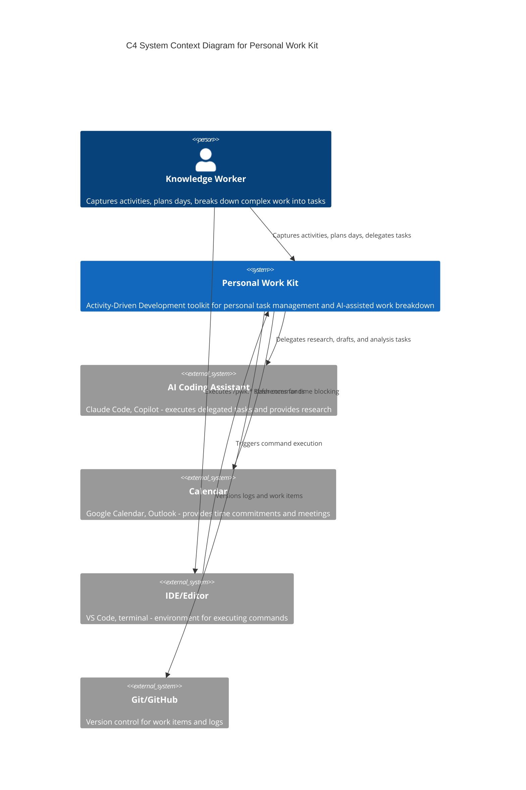
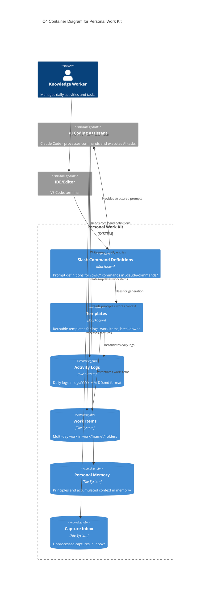
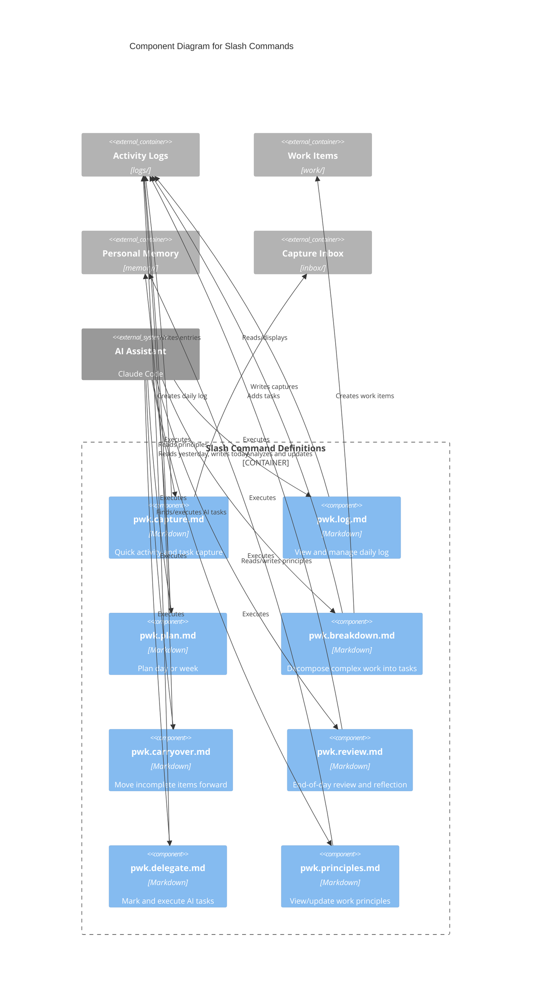
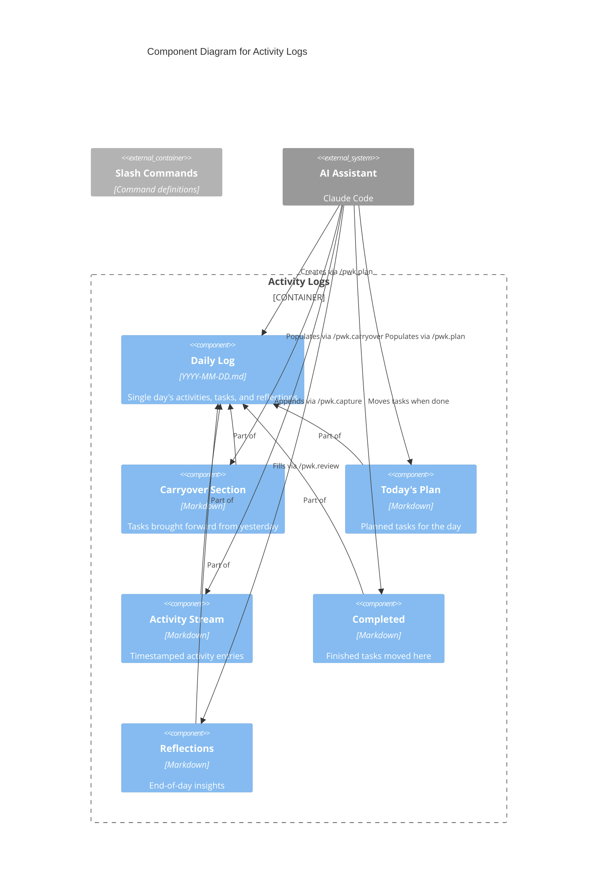
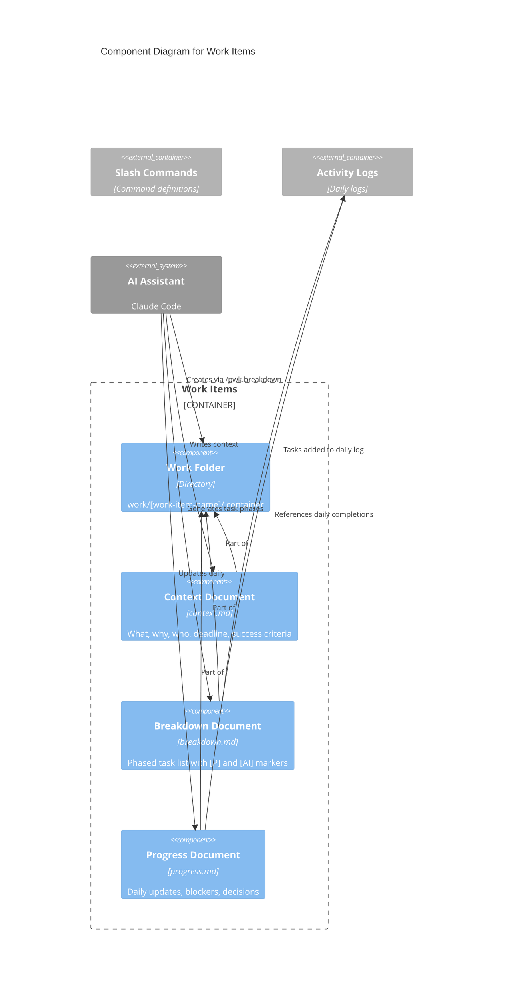
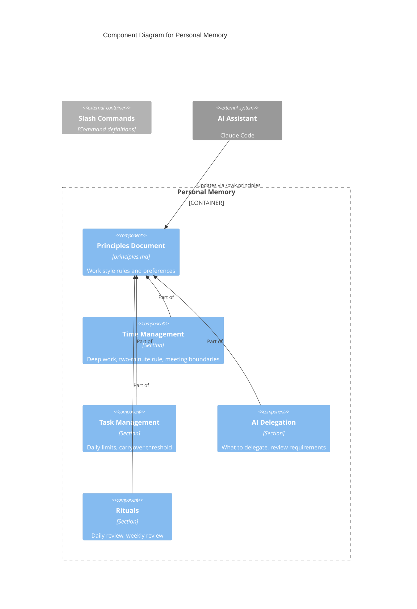

# Personal Work Kit (PWK) C4 Architecture Diagrams

> C4 diagrams showing the architecture of Personal Work Kit at Context, Container, and Component levels.

## Table of Contents

1. [System Context Diagram](#1-system-context-diagram)
2. [Container Diagram](#2-container-diagram)
3. [Component Diagrams](#3-component-diagrams)

---

## 1. System Context Diagram

Shows PWK and its interactions with users and external systems.



### Context Elements

| Element | Type | Description |
|---------|------|-------------|
| Knowledge Worker | Person | Primary user managing their daily work and tasks |
| Personal Work Kit | System | Core toolkit for activity capture, planning, and breakdown |
| AI Coding Assistant | External | Executes delegated [AI] tasks |
| Calendar | External | Source of time commitments for planning |
| IDE/Editor | External | Environment where commands are executed |
| Git/GitHub | External | Version control for persistence |

---

## 2. Container Diagram

Shows the internal containers within Personal Work Kit.



### Container Descriptions

| Container | Technology | Description |
|-----------|------------|-------------|
| Slash Command Definitions | Markdown | 8 command files defining /pwk.capture, /pwk.log, /pwk.plan, /pwk.breakdown, /pwk.carryover, /pwk.review, /pwk.delegate, /pwk.principles |
| Templates | Markdown | Templates for daily-log.md, work-item.md, breakdown.md, progress.md, principles.md |
| Activity Logs | File System | `logs/YYYY-MM-DD.md` files tracking daily activities, tasks, and reflections |
| Work Items | File System | `work/[name]/` folders containing context.md, breakdown.md, progress.md for multi-day work |
| Personal Memory | File System | `memory/principles.md` storing work style principles referenced by all commands |
| Capture Inbox | File System | `inbox/quick-capture.md` for unprocessed thoughts and captures |

### Data Flow

1. **Capture**: User runs `/pwk.capture` → AI adds to logs/ or inbox/
2. **Plan**: `/pwk.plan` reads memory/principles + previous logs → creates today's log
3. **Breakdown**: `/pwk.breakdown` analyzes work → creates work item or adds tasks to log
4. **Carryover**: `/pwk.carryover` reads yesterday's log → moves incomplete to today
5. **Delegate**: `/pwk.delegate` finds [AI] tasks → AI executes and updates logs
6. **Review**: `/pwk.review` analyzes today's log → adds reflections, prepares carryover

---

## 3. Component Diagrams

### 3.1 Slash Command Components



### Command Workflow

| Phase | Commands | Purpose |
|-------|----------|---------|
| Morning | carryover → plan | Start the day |
| Throughout Day | capture, breakdown, delegate | Work execution |
| End of Day | review | Close the day |
| Meta | log, principles | View and configure |

---

### 3.2 Activity Logs Components



### Daily Log Structure

```
logs/2024-01-15.md
├── Carryover from Yesterday (populated by /pwk.carryover)
├── Today's Plan (populated by /pwk.plan)
├── Activity Stream (appended by /pwk.capture)
├── Completed (tasks moved here when done)
├── Blockers (waiting items)
└── Reflections (filled by /pwk.review)
```

---

### 3.3 Work Items Components



### Work Item Lifecycle

```
1. Created: /pwk.breakdown creates work/[name]/
2. Planned: context.md filled with scope and criteria
3. Broken Down: breakdown.md has phased tasks
4. Executed: Tasks flow to daily logs
5. Tracked: progress.md updated daily
6. Completed: All tasks done, work item archived
```

---

### 3.4 Personal Memory Components



### Principles Application

| Principle Category | Used By |
|--------------------|---------|
| Time Management | /pwk.plan (time blocking) |
| Task Management | /pwk.plan (limits), /pwk.carryover (threshold) |
| AI Delegation | /pwk.delegate (criteria) |
| Rituals | /pwk.review (shutdown) |

---

## Comparison: PWK vs Spec-Kit Architecture

| Aspect | Spec-Kit | Personal Work Kit |
|--------|----------|-------------------|
| **Primary Artifact** | Specification (spec.md) | Activity Log (YYYY-MM-DD.md) |
| **Governance** | Constitution | Principles |
| **Decomposition** | Plan → Tasks | Breakdown → Tasks |
| **Execution** | /speckit.implement | /pwk.delegate (AI) + manual |
| **Quality Check** | /speckit.analyze | /pwk.review |
| **Carryover** | Feature branches | Daily log chain |
| **AI Role** | Code generation | Task delegation |
| **Time Scope** | Feature lifecycle | Daily cycle |

---

## References

- [Personal Work Kit Context](./pwk-context.md)
- [Spec-Kit C4 Diagrams](../speckit-c4-context.md)
- [C4 Model](https://c4model.com/)
